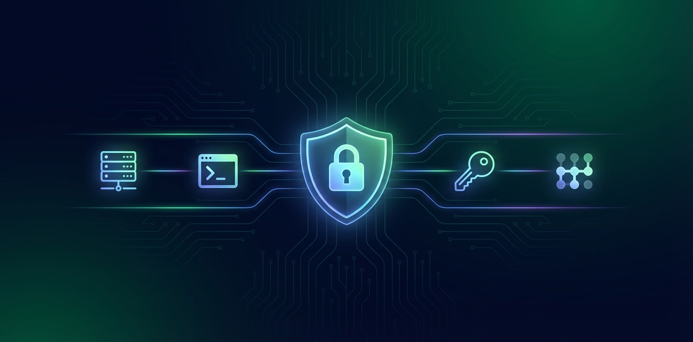

<p align="center">
  
</p>

# VPS Secure Setup

A guided interactive wizard that hardens your VPS step by step.

No guesswork, no manual config — just answer a few prompts and you're done.

## What It Does

The wizard walks you through 3 phases:

1. **Install & authenticate Tailscale** — connects your VPS to your private network
2. **Harden SSH** — restricts access to your Tailscale IP, disables password auth, disables root login
3. **Create a non-root sudo user** — sets up a safe admin account to replace root access

## Safety Features

- Confirmation prompt before every critical change
- Automatic rollback if SSH validation fails or you can't reconnect
- Verification prompts after SSH hardening and user creation — you confirm it works before moving on
- Idempotent: safe to re-run if a step was already completed

## Usage

```bash
curl -fsSL https://raw.githubusercontent.com/rankgnar/vps-secure-setup/main/install-wizard.sh | sudo bash
```

Or clone and run locally:

```bash
git clone https://github.com/rankgnar/vps-secure-setup.git
cd vps-secure-setup
sudo bash install-wizard.sh
```

## Requirements

- Fresh VPS running **Ubuntu** or **Debian**
- Root access (run with `sudo`)
- A Tailscale account (free at [tailscale.com](https://tailscale.com))

## License

MIT
